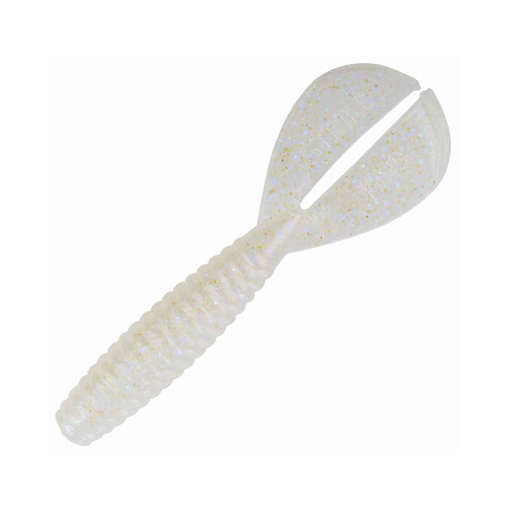

Chatterbaits for Spawn time largemouth bass fishing. Finding active fish willing to bite a moving bait is very productive in the spring. Fish are shallow and can be very aggressive.

>Take advantage of that.

Largemouth bass want to spawn in water that is **shallow 3-5 ft** is common but with stable water conditions, they may have as little as 6 inches over their heads.

Often they want a piece of cover to hide in or around to go with it. A laydown or logs or virtually any stick or piece of cover in the backs of creeks and coves has the potential to hold a giant bass.

Call it a Chatter-Bait or a Chaturbate or a Chatturbait I've heard all the names, the general name is vibrating blade bait or a bladed swim jig.

## How to fish the Chatterbait

### Cast to target and begin retrieve like a crankbait.

6.x Gear Ratio Quality Reel - I like the Shimano Curado DC.

### When a fish bites

Allow the fish to load the rod up under its own weight and continue to wind the reel.

Use a sweep style hookset while continuing to wind the reel to the side instead of pulling up and yanking. This will use the weight of the fish to bury the hook on itself without letting the blade to wedge open its mouth and pull the bait away, losing a fish.

#### Z-man is the Original and remains very popular

> Created by Z-MAN Chatterbait is their brand name but several different varieties exist.
Z-MAN Chatter Bait, 5/8 oz, White

Variations include where the line ties to the blade or the way the blade attaches to the hook, some of the jig heads wobble independently as well.

### Strike King Pure Poison

Very popular with professional anglers on the pro bass fishing tours. Slightly different shape to the blade causing different swimming action than the original.

<figure>

[]

<figcaption>

  
Strike King Pure Poison

</figcaption>

</figure>

### JackHammer Chatterbait - B. Hite design

Brett Hite is considered the master of the bladed swim jig on the pro tours. He's the man!

His bait of choice is the JackHammer and he uses it like one on the competition.

<figure>

<figcaption>

jackhammer-bladed-jig

</figcaption>

</figure>

MLF recently showed the power of the vibrating bladed jig in Raleigh.

## 4 great choices for trailers.

The Yamamoto swim Senko is a lively and active tail to choose. The added length helps present a bigger profile to hungry fish.

<figure>

[]

<figcaption>

Yamamoto Swim Senko

</figcaption>

</figure>

LFT "Live" Magic Shad - Paddle tail or Fork tail matters to the fish, occasionally.

<figure>

[]
<figcaption>

LFT "Live" Magic Shad Golden Shiner

</figcaption>

</figure>

Rage Twin Tail Menace to show them something different.

<figure>

[]

<figcaption>

  
Rage Twin Tail Menace 

</figcaption>

</figure>

Keitech Fat Swing Impact-

Soft, full of salt and full of action. Works well on the Alabama Rig too.

<figure>

[]

<figcaption>

Keitech FSI43-418 Fat Swing Impact

</figcaption>

</figure>

### The Rod Setup for a Chatterbait

> Use a heavy action parabolic glass rod for best results.
> 
> Brett Hite

#### 7ft plus Fiberglass Evergreen Rod is B. Hites goto

Evergreen Cranking Blade Jig Fishing Rod Daiwa Evergreen RCSC-73HG Cranking Blade Jig Fishing Rod.  

<figure>

[]

<figcaption>

Daiwa Evergreen RCSC-73HG Cranking Blade Jig Fishing Rod

</figcaption>

</figure>

#### 20 lb fluorocarbon fishing line

I love my Seaguar Tatsu. Tough stuff.

<figure>

<figcaption>

Best Fluorocarbon line

</figcaption>

</figure>

There you have it.

The best setup to fish the Chatterbait.

Tight Lines!

@ksbigbass
